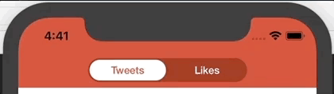
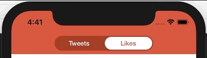

:name: EASegments
:author: Elias Abel
:author_esc: Elias%20Abel
:mail: admin@meniny.cn
:desc: a segments control for iOS
:icon: {name}.png
:version: 1.0.1
:na: N/A
:ios: 8.0
:macos: {na}
:watchos: {na}
:tvos: {na}
:linux: {na}
:xcode: 9.3
:swift: 4.1
:license: MIT
:sep: %20%7C%20
:platform: iOS
// :toc: left
:toclevels: 6
:toc-title: TOC
:source-highlighter: highlightjs
// :source-highlighter: pygments
= Meet `{name}`
{author} <{mail}>
v{version}, 2018-05-08

[subs="attributes"]
++++

  
    
  
  
  
   
  
  
  
   
  
  
  
  

++++

:toc:

== 🏵 Introduction

**{name}** is {desc}.

== 📋 Requirements

[%header]
|===
2+^m|Type 1+^m|Requirement

1.5+^.^|Platform ^|iOS ^|{ios}+
^|macOS ^|{macos}
^|tvOS ^|{tvos}
^|watchOS ^|{watchos}
^|Linux ^|{linux}

^|IDE ^|Xcode ^| {xcode}+
^|Language ^|Swift ^| {swift}+
|===

== 📲 Installation

=== CocoaPods

`{name}` is available on link:https://cocoapods.org[CocoaPods].

[source, ruby, subs="verbatim,attributes"]
----
use_frameworks!
pod '{name}'
----

=== Manually

Copy all files in the `{name}` directory into your project.

== 🛌 Dependency

{na}

== ❤️ Contribution

You are welcome to fork and submit pull requests.

== 🔖 License

`{name}` is open-sourced software, licensed under the link:./LICENSE.md[`{license}`] license.

== 🔫 Usage

[source, swift, subs="verbatim,attributes"]
----
import {name}

func setup() {
    let flamingo = #colorLiteral(red: 0.92, green: 0.38, blue: 0.25, alpha: 1.00)

    let segments = EASegments(titles: ["Tweets", "Likes"])
    // use frame, or AutoLayout
    segments.frame = CGRect(x: 30.0, y: 40.0, width: 200.0, height: 30.0)

    segments.backgroundColor = flamingo
    segments.selectedBackgroundColor = .white

    segments.titleColor = .white
    segments.selectedTitleColor = flamingo

    segments.titleFont = UIFont(name: "HelveticaNeue-Medium", size: 13.0)

    // do this:
    // segments.addTarget(self, action: #selector(segmentsValueDidChange(:)), for: .valueChanged)
    // or this:
    segments.delegate = self // EASegmentsDelegate?

    someView.addSubview(segments)
}

// addTarget
@objc
func segmentsValueDidChange(_ sender: EASegments) {
    print("valueChanged: \(sender.selectedIndex) [\(sender.selectedTitle ?? "nil")]")
}

// EASegmentsDelegate
func segments(_ segments: EASegments, didSelectAt index: Int) {
    print("didSelectAt: \(segments.selectedIndex) [\(segments.selectedTitle ?? "nil")]")
}
----
